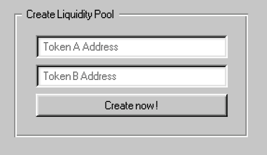
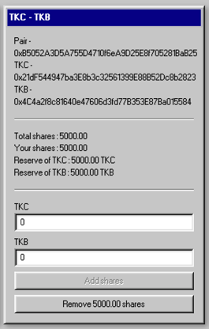

# Dexter UI - Decentralized Exchange Frontend

A modern and intuitive user interface for interacting with the Dexter protocol, an Automated Market Maker (AMM) built on Ethereum.

## Features

- **Token Swaps**: Swap ERC20 tokens with customizable slippage settings  
  

- **Create Pools**: Deploy new liquidity pools for custom token pairs  
  

- **Add Liquidity**: Provide liquidity to existing pools and earn transaction fees  

- **Remove Liquidity**: Withdraw your funds while keeping a share of the generated fees  
  

## Installation

```bash
# Install dependencies
npm install

# Start the application in development mode
npm run dev
```

## Blockchain Interaction

Dexter UI utilizes **Wagmi** and **Viem** for seamless blockchain interactions. The DEX is accessible at:

🔗 [Dexter UI on Sepolia](https://dexter-ui-eight.vercel.app/)

